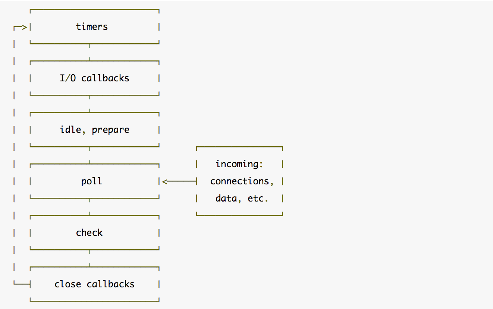

### 浏览器环境下的事件循环

- 当javascript代码执行的时候会将不同的变量存于内存中的不同位置：堆（heap）和栈（stack）中来加以区分。其中,堆里存放着一些对象。而栈中则存放着一些基础类型变量以及对象的指针。 但是我们这里说的执行栈和上面这个栈的意义却有些不同。

 - 我们知道,当我们调用一个方法的时候,js会生成一个与这个方法对应的执行环境（context）,又叫执行上下文。这个执行环境中存在着这个方法的私有作用域,上层作用域的指向,方法的参数,这个作用域中定义的变量以及这个作用域的this对象。 而当一系列方法被依次调用的时候,因为js是单线程的,同一时间只能执行一个方法,于是这些方法被排队在一个单独的地方。这个地方被称为执行栈。

- 当一个脚本第一次执行的时候,js引擎会解析这段代码,并将其中的同步代码按照执行顺序加入执行栈中,然后从头开始执行。如果当前执行的是一个方法,那么js会向执行栈中添加这个方法的执行环境,然后进入这个执行环境继续执行其中的代码。当这个执行环境中的代码 执行完毕并返回结果后,js会退出这个执行环境并把这个执行环境销毁,回到上一个方法的执行环境。。这个过程反复进行,直到执行栈中的代码全部执行完毕。

- 以上的过程说的都是同步代码的执行。那么当一个异步代码（如发送ajax请求数据）执行后会如何呢？前文提过,js的另一大特点是非阻塞,实现这一点的关键在于下面要说的这项机制——事件队列（Task Queue）。

- js引擎遇到一个异步事件后并不会一直等待其返回结果,而是会将这个事件挂起,继续执行执行栈中的其他任务。当一个异步事件返回结果后,js会将这个事件加入与当前执行栈不同的另一个队列,我们称之为事件队列。被放入事件队列不会立刻执行其回调,而是等待当前执行栈中的所有任务都执行完毕, 主线程处于闲置状态时,主线程会去查找事件队列是否有任务。如果有,那么主线程会从中取出排在第一位的事件,并把这个事件对应的回调放入执行栈中,然后执行其中的同步代码...,如此反复,这样就形成了一个无限的循环。这就是这个过程被称为“事件循环（Event Loop）”的原因。

#### macro task与micro task
以上的事件循环过程是一个宏观的表述,实际上因为异步任务之间并不相同,因此他们的执行优先级也有区别。不同的异步任务被分为两类：微任务（micro task）和宏任务（macro task）。
##### 以下事件属于宏任务
- setInterval()
- setTimeout()
- setImmediate
- i/o
- UI rendering
##### 以下是微任务
- new Promise的then和catch
- process.nextTick
- MutationObserver

每一次eventLoop触发时：
1.执行完主线程中的同步任务
2.取出微任务中任务执行直到清空
3.取出宏任务中的一个任务执行
4.取出微任务中任务执行直到清空
5.重复3和4
注意：同一次事件循环中,微任务永远在宏任务之前执行
##### 举个简单栗子
case 1
```
console.log('world')
let doSth = new Promise((resolve, reject) => {
    console.log('hello');
    resolve();
});

setTimeout(() => {
    doSth.then(() => {
        console.log('over');
    })
}, 1000);
//world
//hello 
//over 一秒钟后输出
```
- 1.先执行主线程任务输出world毫无疑问
- 2.然后执行微任务,所以走promise,输出hello,然后执行resove(),这时候then是在setTimeout里面,属于宏任务,先挂起,看微任务是否执行完毕,然后执行宏任务,一秒钟后执行then输出over

case 2
```
console.log('1')
let doSth = new Promise((resolve, reject) => {
    console.log('2');
    resolve();
    console.log('4')
});

setTimeout(() => {
    doSth.then(() => {
        console.log('3');
    })
}, 0);
setTimeout(() => {
console.log('5')
}, 0);
//1
//2
//4
//3
//5
```
- 1.先执行主线程,输出1
- 2.然后执行微任务promise,先输出2,然后执行resolve（）,此时正常应该先执行then方法,但是他在宏任务里面,暂时先挂起放到队列里头,往后继续执行输出4,此时微任务全部执行完毕
- 3.再执行下面的宏任务。正常来说两个setTimeout哪个延时少先执行哪个的回调,这里都是0,所以从上往下执行,先执行上面then输出3,这个宏任务执行完成。
- 4.然后再执行微任务,发现没有微任务了,然后继续执行宏任务,最后输出5

case 3 升级版
```
console.log('1')
let doSth = new Promise((resolve, reject) => {
    console.log('2');
    resolve();
    console.log('4')
    setTimeout(() => {
        console.log('8')
    }, 0)
    setTimeout(()=>{
     console.log('11')
    },0)
});
let doSth1 = new Promise((resolve, reject) => {
    console.log('6');
    resolve();
    setTimeout(() => {
        console.log('9')
    }, 0)
});

setTimeout(() => {
    console.log('10')
    doSth.then(() => {
        console.log('3');
    })
}, 0);
setTimeout(() => {
    console.log('5')
    doSth1.then(() => {
        console.log('7');
    })
}, 0);
 //1
 //2
 //4
 //6
 //8
 //11
 //9
 //10
 //3
 //5
 //7
```
- 1.其实原理类似,先执行主线程上的同步代码输出1,同步代码执行完毕
- 2.然后执行微任务直到清空,第一个promise输出2和4,遇到setTimeout挂起放到队列,再执行第二个promise输出6,遇到setTimeout挂起放到第一个队列后面,然后执行微任务中的队列回调,输出8,11,9,至此微任务清空完毕,然后取一个宏任务,setTimeout输出10和3,然后查看微任务发现是空的,然后执行宏任务,执行最后一个setTimeout输出5,7

case 4
```
console.log('global')

for (var i = 1;i <= 5;i ++) {
  setTimeout(function() {
    console.log(i)
  },i*1000)
  console.log(i)
}

new Promise(function (resolve) {
  console.log('promise1')
  resolve()
 }).then(function () {
  console.log('then1')
})

setTimeout(function () {
  console.log('timeout2')
  new Promise(function (resolve) {
    console.log('timeout2_promise')
    resolve()
  }).then(function () {
    console.log('timeout2_then')
  })
}, 1000)
//global
//1
//2
//3
//4
//5
//promise1
//then1
//6
//timeout2
//promise2_promise
//timeout_then
//6
//6
//6
//6
```
- 1.先走主线程的同步代码,输出global
- 2.for循环里面有异步任务,循环出5个setTimeout,先挂起,执行同步代码,依次输出1,2,3,4,5,主线程上同步执行完毕,然后执行微任务promise,输出promise1,then1,微任务执行完毕
- 3.然后执行宏任务,for循环里面有第一次,i=1的时候延迟一秒,执行这个setTimeout,输出6（异步回调里面的i此时已经是6了）,这个宏任务执行完毕
- 4.然后查看微任务,没有,所以继续执行宏任务,此时执行栈里面就剩几个setTimeout了,所以根据延迟时间由少到多依次执行,输出timeout2,timeout2_promise,timeout2_then
- 5.然后一秒一次一次输出接下来的四个6
### 先看看node是如何工作的

- 1.我们写的js代码会交给v8引擎进行处理
- 2.代码中可能会调用nodeApi,node会交给libuv库处理
- 3.libuv通过阻塞i/o和多线程实现了异步io
- 4.通过事件驱动的方式,将结果放到事件队列中,最终交给我们的应用。

在看看libuv引擎中事件循环的模型

从图中看出node循环的顺序：
外部输入数据-->轮询阶段(poll)-->检查阶段(check)-->关闭事件回调阶段(close callback)-->定时器检测阶段(timer)-->I/O事件回调阶段(I/O callbacks)-->闲置阶段(idle, prepare)-->轮询阶段...
大致功能如下:
- timers: 这个阶段执行定时器队列中的回调如 setTimeout() 和 setInterval()。
- I/O callbacks: 这个阶段执行几乎所有的回调。但是不包括close事件,定时器和setImmediate()的回调。例如一个TCP连接生错误时,系统需要执行回调来获得这个错误的报告。
- idle, prepare: 这个阶段仅在内部使用,可以不必理会。
- poll: 等待新的I/O事件,node在一些特殊情况下会阻塞在这里。
- check: setImmediate()的回调会在这个阶段执行。当poll阶段进入空闲状态,并且setImmediate queue中有callback时,事件循环进入这个阶段。
- close callbacks: 例如socket.on('close', ...)这种close事件的回调。

参考链接:
<https://zhuanlan.zhihu.com/p/33058983>
<https://nodejs.org/en/docs/guides/event-loop-timers-and-nexttick/>

