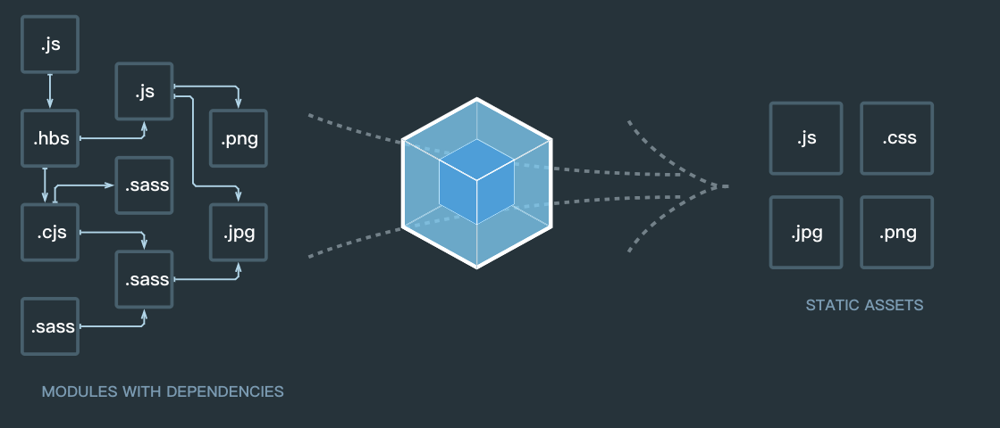

### 1.什么是webpack
- 先看官网给出的一张图

- 官方介绍:本质上,webpack 是一个现代 JavaScript 应用程序的静态模块打包器(module bundler)。当 webpack 处理应用程序时,它会递归地构建一个依赖关系图(dependency graph),其中包含应用程序需要的每个模块,然后将所有这些模块打包成一个或多个 bundle。
##### 简单来说主要有一下几方面作用
- 文件优化:压缩HTML,css,js代码并且可以压缩合并图片
- 自动刷新:监听本地源代码的更新,自动构建刷新浏览器,解放生产力,使开发更友好
- 代码转换:ts代码转换成JavaScript代码,less和sass转换成css,es6和es7代码转成es5兼容低端浏览器
- 模块合并:在模块化文件里可能会有多个文件。构建的时候可以把多个文件合并成一个文件
- 代码分割:提取多个页面的公关代码,提取首屏不需要执行的代码让其异步加载
###### 总之就是优化项目,可以实现前端工程化,解放生产力
### 2.webpack的使用
- 初始化项目
```
npm install webpack webpack-cli -D
```

- Webpack 启动后会从Entry里配置的Module开始递归解析 Entry 依赖的所有 Module。 每找到一个 Module, 就会根据配置的Loader去找出对应的转换规则,对 Module 进行转换后,再解析出当前 Module 依赖的 Module。 这些模块会以 Entry 为单位进行分组,一个 Entry 和其所有依赖的 Module 被分到一个组也就是一个 Chunk。最后 Webpack 会把所有 Chunk 转换成文件输出。 在整个流程中 Webpack 会在恰当的时机执行 Plugin 里定义的逻辑。

- webpack需要在项目根目录下创建一个webpack.config.js来导出webpack的配置,配置多样化,可以自行定制,下面讲讲最基础的配置。
```
module.exports = {
	entry: './src/index.js',// 入口,webpack会找到该文件进行解析
	output: {
		path: path.join(__dirname, './dist'),//输出路径
		filename: 'main.js',// 输出文件名称
	}// 出口,代表输出文件配置
}
```
有的时候我们项目并不是spa,那么需要生成多个js文件,这时需要配置多入口
```
module.exports = {
	entry: {
		pageA: './src/pageA.js',
		pageB: './src/pageB.js'
	},
	output: {
		path: path.join(__dirname, './dist'),
		filename: '[name].[hash:8].js',
	},
}
```
entry配置一个对象,<font color=red size=3>key</font>值就是<font color=red size=3>chunk</font>
 :代码块,一个 Chunk 由多个模块组合而成,用于代码合并与分割。看看<font color=red size=3>filename[name]</font>: 这个name指的就是chunk的名字,我们配置的key值pageA pageB,这样打包出来的文件名是不同的,再来看看[hash],这个是给输出文件一个hash值,避免缓存,那么:8是取前8位。

这里有人会有疑问了,项目是多页面的,应该有pageA.html``pageA.js``pageA.css, 那么我应该生成多个html,这个只是做了JS的入口区分,我不想每一个页面都去复制粘贴一个html,并且html是大部分重复的,可能不同页面只需要修改title,下面来看看这个问题怎么解决:
这时候需要引入一个webpack的plugin:
```
npm install html-webpack-plugin -D
```
该插件可以给每一个chunk生成html,指定一个template,可以接收参数,在模板里面使用,下面来看看如何使用:
```
const HtmlWebpackPlugin = require('html-webpack-plugin');

module.exports = {
	entry: {
		pageA: './src/pageA.js',
		pageB: './src/pageB.js'
	},
	output: {
		path: path.join(__dirname, './dist'),
		filename: '[name].[hash:8].js',
	},
	plugins: [
		 new HtmlWebpackPlugin({
            template:'./src/templet.html',//html的路径地址
            filename: 'pageA.html',//生成的文件名
            title: 'pageA',//传入的参数
            chunks: ['pageA'],//需要引入的chunk
            hash: true,// 在js的后面加hash,避免缓存
            minify: {
                removeAttributeQuotes: true
            }//去掉双引号,减少文件大小,这里还可以增加多个配置
        }),
        new HtmlWebpackPlugin({
            template: './src/templet.html',
            filename: 'pageB.html',
            title: 'pageB',
            chunks: ['pageB'],
            hash: true,
            minify: {
                removeAttributeQuotes: true
            }
        }),
	]
}
```
这样在dist目录下就生成了pageA.html和pageB.html并且通过配置chunks,让pageA.html里加上了script标签去引入pageA.js。那么现在还剩下css没有导入,css需要借助loader去做,所以现在要下载几个依赖,以scss为例,less同理
```
npm install css-loader style-loader sass-loader node-sass -D
```
- css-loader:支持css中的import
- style-loader:把css写入style内嵌标签
- sass-loader:scss转换为css
- node-sass:scss转换依赖
loader的配置
```
module.exports = {
	module: {
        rules: [
        		{
        			test: /\.scss$/,//匹配文件
        			use: ['style-loader', 'css-loader', 'sass-loader'],//放置需要执行的loader,有顺序要求,从右到左执行
        			exclude: /node_modules/ //取消匹配node_modules里面的文件
        		}
        ]
    }
}
```
如果想把css作为一个单独的文件,防止将样式打包在js中引起页面样式加载错乱的现象,需要用到一个插件来做(webpack4.0.0以上版本需要next版本):
```
 npm i extract-text-webpack-plugin@next -D
```
```
const ExtractTextPlugin = require('extract-text-webpack-plugin');
module.exports = {
	entry: './src/index.js',
	output: {
		path: path.join(__dirname, './dist'),
		filename: 'main.js',
    },
    module: {
        rules: [
            {
                test: /\.scss$/,
                use: ExtractTextPlugin.extract({
                    // style-loader 把css直接写入html中style标签
                    fallback: 'style-loader',
                    // css-loader css中import支持
                    // loader执行顺序 从右往左执行
                    use: ['css-loader', 'sass-loader']
                }),
                exclude: /node_modules/
            }
        ]
    },
    plugins: [
        new ExtractTextPlugin('[name].[contenthash:8].css'),
    ]
}

```
再看看一些常用的loader
- babel-loader: 用babel转换代码
- url-loader: 依赖于file-loader,把图片转换成base64嵌入html,如果超出一定阈值则交给file-loader
```
rules: [
		 // 处理js
		 {
            test: /\.js?$/,
            exclude: /node_modules/,
            use: ['babel-loader']
        },
        // 处理图片
        {
            test: /\.(png|jpg|gif|ttf|eot|woff(2)?)(\?[=a-z0-9]+)?$/,
            use: [{
                loader: 'url-loader',
                options: {
                    query: {
                        // 阈值 单位byte
                        limit: '8192',
                        name: 'images/[name]_[hash:7].[ext]',
                    }
                }
            }]
        },
	]
```
babel的配置建议在根目录下新建一个.babelrc文件
```
{
    "presets": [
        "env",//只转换新的语法,例如const let => ..等 不转换 Iterator、Generator、Set、Maps、Proxy、Reflect、Symbol、Promise、Object.assign。
        "stage-0", //es7提案转码规则 有 0 1 2 3 阶段 0包含 1 2 3里面的所有
        "react"//转换jsx语法
    ],
    // 插件 可以自己开发插件 转换代码(依赖于ast抽象语法数)
    "plugins": [
        "transform-runtime",// 转换新语法,自动引入polyfill插件,另外可以避免污染全局变量
        "transform-decorators-legacy",// 支持装饰器
        "add-module-exports"//转译export default {}; 添加上module.exports = exports.default 支持commonjs
    ]
}
```
因为我们在文件名中加入hash值,打包多次后dist目录变得非常多文件,没有删除或覆盖,这里可以引入一个插件,在打包前自动删除dist目录,保证dist目录下是当前打包后的文件:
```
plugins: [
	new CleanWebpackPlugin(
	    // 需要删除的文件夹或文件
	    [path.join(__dirname, './dist/*.*')],
	    {
	        // root目录
	        root: path.join(__dirname, './')
	    }
	),
]
```
指定extension之后可以不用在require或是import的时候加文件扩展名,会依次尝试添加扩展名进行匹配:
```
resolve: {
    extensions: ['.js', '.jsx', '.scss', '.json'],
}
```
alias
配置别名可以加快webpack查找模块的速度

- 每当引入jquery模块的时候,它会直接引入jqueryPath,而不需要从node_modules文件夹中按模块的查找规则查找
- 不需要webpack去解析jquery.js文件
```
const bootstrap=path.join(__dirname,'node_modules/bootstrap/dist/css/bootstrap.css')
resolve: {
      alias: {
           'bootstrap': bootstrap
       }
    },

```

 ##### 压缩css
webpack可以消除未使用的CSS,比如bootstrap中那些未使用的样式
```
npm i -D purifycss-webpack purify-css
npm i bootstrap -S
```
```
{
                test:/\.css$/,
                use: cssExtract.extract({
                    use: [{
                         loader: 'css-loader',
 +                       options:{minimize:true}
                    },'postcss-loader']
                }),
            }
```
```
new PurifyCSSPlugin({
+             //purifycss根据这个路径配置遍历你的HTML文件,查找你使用的CSS
+            paths:glob.sync(path.join(__dirname,'src/*.html'))
+ }),
```
##### 提取第三方库
```
module.exports = {
    entry: {
        main: './src/index.js',
        vendor: ['react', 'react-dom'],
    },
}
```
单单像上面这样配置，打包后会得到 main.js 和 vendor.js，但会发现在 main.js 中依然包含了 react 和 react-dom 的代码，这是因为指定了入口后，webpack 就会从入口文件开始讲整个依赖打包进来，index.js 中引用了 react 和 react-dom 自然会被打包进去。要想达到之前所说的那个效果，还需要借助一个插件 —— CommonsChunkPlugin

##### 提取公共的js文件
webpack4中废弃了webpack.optimize.CommonsChunkPlugin插件,用新的配置项替代,把多次import的文件打包成一个单独的common.js
```
module.exports = {
	entry: './src/index.js',
	output: {
		path: path.join(__dirname, './dist'),
		filename: 'main.js',
	},
    optimization: {
        splitChunks: {
            cacheGroups: {
                commons: {
                    chunks: 'initial',
                    minChunks: 2,
                    maxInitialRequests: 5,
                    minSize: 2,
                    name: 'common'
                }
            }
        }
    },
}
```
##### DLL动态链接
第三方库不是经常更新,打包的时候希望分开打包,提升打包速度。打包dll需要新建一个webpack配置文件,在打包dll的时候,webpack做一个索引,写在manifest文件中。然后打包项目文件时只需要读取manifest文件。
```
webpack.vendor.js
const webpack = require('webpack');
const path = require('path');

module.exports = {
    entry: {
        vendor: ['react', 'react-dom'],
    },
    output: {
        path: path.join(__dirname, './dist'),
        filename: 'dll/[name]_dll.js',
        library: '_dll_[name]',
    },
    plugins: [
        new webpack.DllPlugin({
            path: path.join(__dirname, './dist/dll', 'manifest.json'),
            name: '_dll_[name]',
        }),
    ]
};

```
path: manifest文件的输出路径 name: dll暴露的对象名,要跟output.library保持一致 context: 解析包路径的上下文,这个要跟接下来配置的dll user一致
```
webpack.config.js
module.exports = {
    entry: {
        main: './src/index.js',
        vendor: ['react', 'react-dom'],
    },
    plugins: [
        new webpack.DllReferencePlugin({
            manifest: path.join(__dirname, './dist/dll', 'manifest.json')
        })
    ]
}

```
```
html
<script src="vendor_dll.js"></script>
```
##### 上线和开发
线上和开发环境一般都会存在相同点和不同点,所以一般我们会窗前三个配置文件
- webpack.base.js:相同配置文件
- webpack.dev.js:开发环境配置
- webpack.prod.js:生产环境配置
通过webpack-merge去做配置的合并,例如:
开发环境:
```
const path = require('path');
const webpack = require('webpack');
const merge = require('webpack-merge');
const base = require('./webpack.base');

const dev = {
    devServer: {
        contentBase: path.join(__dirname, '../dist'),//静态文件地址
        port: 8080,// 端口
        host: 'localhost',//主机地址
        overlay: true,//如果出错,在浏览器中显示错误
        compress: true,//服务端返回浏览器的时候是否启用gzip压缩
        open:true,//打包完成自动打开浏览器
        hot: true,//模块热更新, 需要webpack.HotModuleReplacementPlugin插件
        inline: true,//实时构建
        progress: true,// 显示打包进度
    },
    devtool: 'inline-source-map',
    plugins: [
        new webpack.HotModuleReplacementPlugin(),
        new webpack.NamedModulesPlugin(),
    ]
}
module.exports = merge(base, dev);

```
生产环境
```const path = require('path');
const merge = require('webpack-merge');
const WebpackParallelUglifyPlugin = require('webpack-parallel-uglify-plugin');
const base = require('./webpack.base');

const prod = {
    plugins: [
        new WebpackParallelUglifyPlugin(
            {
                uglifyJS: {
                    mangle: false,//是否混淆代码
                    output: {
                        beautify: false,//代码是否压缩成一行
                        comments: false//去掉注释
                    },
                    compress: {
                        warnings: false,//在删除没用到代码时,不输出警告
                        drop_console: true,//删除console
                        collapse_vars: true,//把定义一次的变量,直接使用,取消定义变量
                        reduce_vars: true//合并多次用到的值,定义成变量
                    }
                }
            }
        ),
    ]
}
module.exports = merge(base, prod);
```
#### 开发一个自己的webpack插件
// TODO
#### 参考链接
- https://juejin.im/post/5ac9dc9af265da23884d5543
- https://www.webpackjs.com/configuration/externals/#externals
